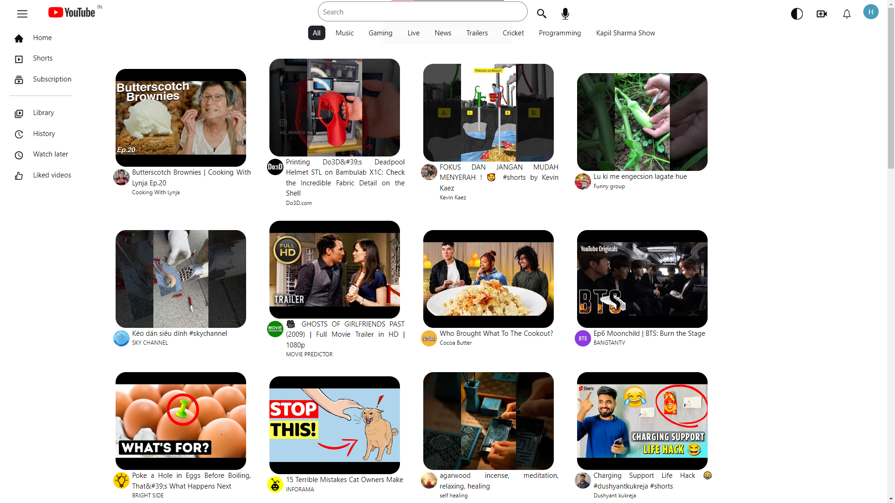
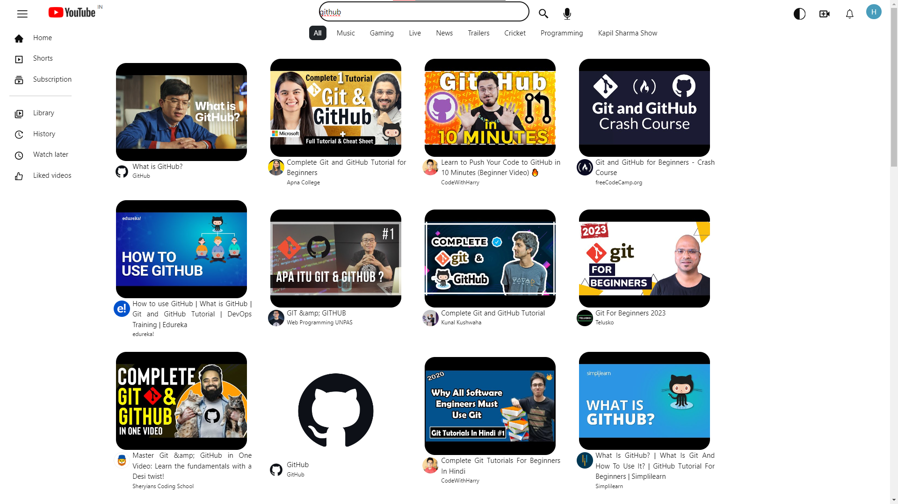
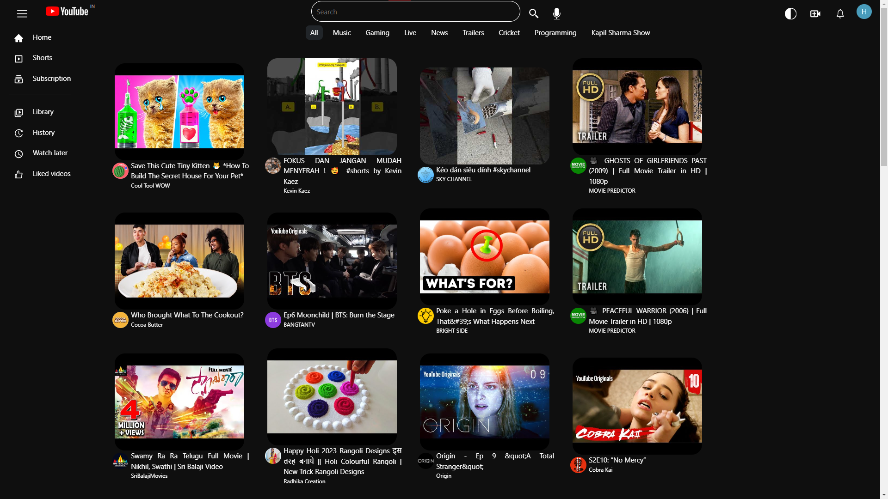
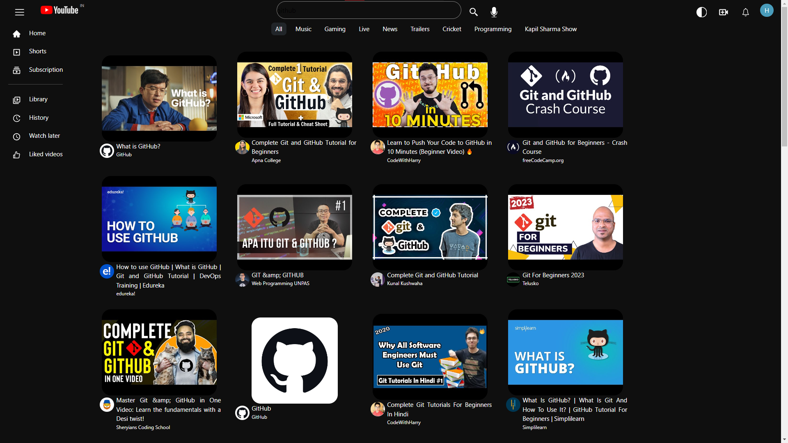

# Youtube Clone


## Description

This is a Youtube Clone built using ReactJS, CSS, and Youtube API. It has all the features of Youtube like searching videos and Home page.

## Table of Contents

## Prerequisites

- **Install Node JS:** Refer to https://nodejs.org/en/ to install nodejs

- **Learn React JS:** If you are new to React JS then you can refer to their [docs](https://react.dev/).

## Setup Instructions

- Clone this repository using the following command.

```
git clone https://github.com/imhardikdesai/Youtube-Clone
```

- Open the project in your favorite code editor.
- Run the following command to install all the dependencies.

```
npm install
```

- Run the following command to start the development server.

```
npm start
```

- Open http://localhost:3000 in your browser to see the app.

## Tech Stack

- ReactJS
- CSS
- Youtube API
- React-Icons

## Screenshots






## Contributing Guidelines

- Please read our [Contributing Guide](CONTRIBUTING.md)
- Ensure you have followed all the steps mentioned in [Contributing Guide](CONTRIBUTING.md) before creating a pull request.
- Pull requests will be merged after being reviewed.
- Issues can be created from [here](https://github.com/imhardikdesai/Youtube-Clone/issues).
- Please make sure you do not create a duplicate issue.
- Please make sure you are assigned to the issue before you start working on it.
- Please make sure you have added proper commit messages and have commented on the code wherever necessary.
- Please make sure you have added the issue number in your pull request description before sending a pull request. For example, "Fixes #5".
- Have fun!

## Contributing Steps

- Fork this repository.
- Create a branch: git checkout -b <branch_name>.
- Make your changes and commit them: git commit -m '<commit_message>'
- Push to the original branch: git push origin <project_name>/<location>
- Create the pull request.

## Author: Desai Hardik

- [GitHub](https://github.com/imhardikdesai)
- [LinkedIn](https://www.linkedin.com/in/imhardikdesai/)
- [Portfolio](https://hardik-portfolio.vercel.app/)
- [Twitter](https://twitter.com/imhardikdesai)
- [Instagram](https://instagram.com/imhardikdesai)

## Contributors✨

<p aligh='center'>
Thanks goes to these wonderful people ❤️
</p>


